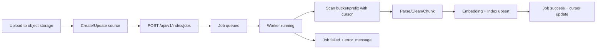

# Ingest 业务流程（场景驱动，去除 local connector）

## 1. 文档目的
- 从用户操作视角定义 ingest 流程。
- 明确 source 与对象存储的职责边界。
- 统一 v0.x 到 v1.0 的实现路线，避免继续扩展 local connector。

---

## 2. 用户场景与操作用例

### 场景 A：管理员接入新知识
- 角色：`KB owner/editor`
- 目标：把文档纳入可检索与可问答范围。
- 用户操作：
  1. 上传文档到对象存储指定目录（bucket/prefix）。
  2. 在系统创建 source（绑定 bucket/prefix/kb_id）。
  3. 触发索引任务。
  4. 查看任务状态与错误信息。
  5. 在检索/问答验证命中与引用。

### 场景 B：文档更新后的增量同步
- 角色：`KB owner/editor`
- 目标：只处理新增/变更对象，避免全量重建。
- 用户操作：
  1. 在对象存储更新文件。
  2. 触发 incremental 索引任务。
  3. 查看索引任务统计（total/indexed/failed）。
  4. 抽样验证更新是否生效。

### 场景 C：任务失败排查
- 角色：`KB owner/editor/研发`
- 目标：定位失败阶段并重试。
- 用户操作：
  1. 查询 `GET /api/v1/index/jobs/{job_id}`。
  2. 读取 `status/error_message`。
  3. 修复 source 配置或对象权限后重试。

---

## 3. Source 设计边界

`source` 负责“数据源定义与同步配置”，不是上传接口本身。

source 管理的内容：
- 数据位置：`provider/bucket/prefix`
- 归属范围：`kb_id`
- 同步策略：`sync_mode`、`cursor`
- 生命周期：`active/paused/error`

上传链路职责：
- 前端上传或后端批量导入，把文件写入对象存储。
- 上传完成后由 source+index_job 负责扫描与索引。

---

## 4. 目标配置模型（object storage first）

当前统一配置语义：
- `source_type=object_storage`
  - `provider`：`minio` / `s3`
  - `bucket`
  - `prefix`
  - `kb_id`
  - `cursor`（增量锚点）

- `source_type=wiki`（后续）
  - `space_key`
  - `cursor`
  - `kb_id`

示例：
```json
{
  "provider": "minio",
  "bucket": "kb-source",
  "prefix": "team-a/hr/",
  "kb_id": "c0a8012e-xxxx-xxxx-xxxx-xxxxxxxxxxxx",
  "cursor": "2026-04-02T00:00:00Z"
}
```

---

## 5. Ingest 目标流程



---

## 6. 状态追踪与可观测

## 6.1 任务层
- `index_job.status`: `queued/running/success/failed`
- `started_at/finished_at`
- `error_message`
- `total_documents/indexed_documents`

## 6.2 文档层（建议补充）
- 对象处理状态：`pending/parsed/chunked/embedded/indexed/failed`
- 每个对象保留 `etag/version/last_modified`
- 与 `source.cursor` 联动，支撑增量与重试

---

## 7. 开发环境映射（docker-compose）

现有开发环境已具备目标链路依赖：
- PostgreSQL（pgvector）
- Redis
- RabbitMQ
- MinIO
- OpenSearch

结论：
- 开发环境已满足“对象存储 + 异步任务 + 索引”的实现条件。
- local connector 不再作为产品正式范围。

---

## 8. 范围约束与演进

当前约束：
- 文档体系与规划不再新增 local connector 需求。
- source 以 object storage / wiki 为准。

下一步实现顺序：
1. source 配置校验切换为 object storage 语义。
2. index_job 改为 API 入队，worker 异步执行。
3. 增量 cursor（对象元数据驱动）。
4. embedding + pgvector。
5. OpenSearch 融合检索。
