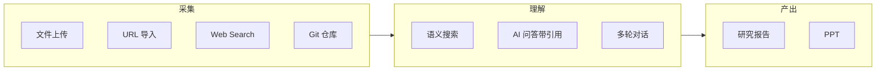

# KnowledgeBase — PRD

## 功能全景

## v0.1.0（当前版本）

| 阶段 | 功能                     | 状态 |
|----|------------------------|----|
| 采集 | 文件上传（PDF/MD/TXT），自动解析入库 | 已完成 |
|    | URL 导入                 |    |
| 理解 | 语义搜索（agentic/hybrid）   | 已完成 |
|    | AI 问答，答案带来源引用          | 已完成 |
|    | 多轮对话，SSE 流式输出          | 已完成 |
| 产出 | 研究报告生成                 |    |
|    | PPT 生成                 |    |

## v0.2.0（规划中）

| 阶段 | 功能                                 |
|----|------------------------------------|
| 采集 | Web Search                         |
|    | Git 仓库同步                           |
| 理解 | mixed 检索策略                         |
|    | 并行 tool calls、Agent Memory、query 重写 |
| 评测 | 检索评测 + LLM-as-Judge 回答评测           |

## 边界

做：
- 创建多个 KnowledgeBase，每个有独立的数据源和文档集
- 文件上传、URL 导入，自动解析入库即可检索
- 多轮对话，SSE 流式输出
- 研究报告与 PPT 生成

不做：
- 多用户 / RBAC / 权限分级 / SSO
- 团队协作 / 评论 / 审批流
- 审计日志 / 合规

---

> 架构决策与技术选型见 @docs/architecture.md。
> 代码规范与工程惯例见 @docs/engineering-standards.md。
